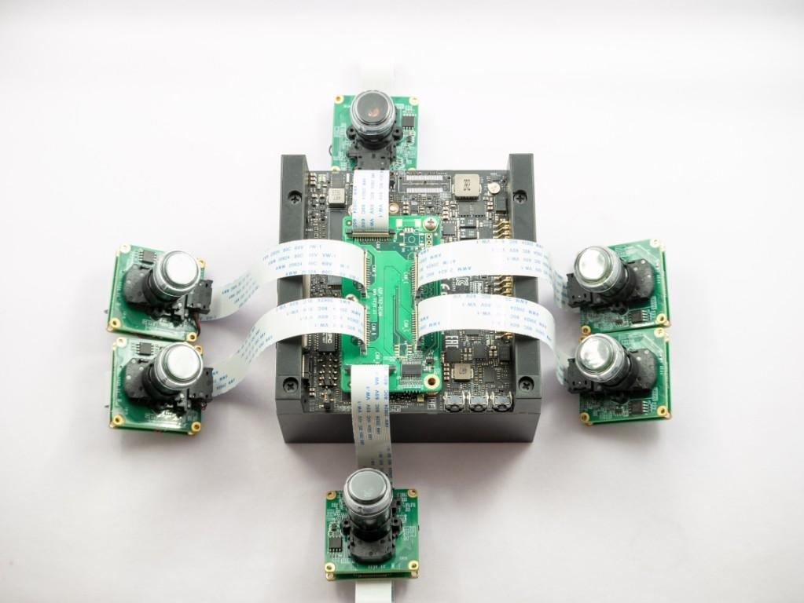

# YEVY MIPI摄像头安装教程

原版详细教程：http://wiki.veye.cc/index.php/VEYE_CS_Camera_for_Jetson_TX2/zh

## 1、安装平台

- 硬件: NVIDIA JETSON AGX
- 相机: YEVY CSI IMX307
- Jetpack: 4.4


## 2、硬件安装

Nvidia Jetson AGX 摄像头安装方式




## 3.软件安装

### 1）查看系统版本

首先查看当前L4T版本，尽量使用同一版本进行替换。

```shell
cat /etc/nv_tegra_release
```

如果显示

```
# R32 (release), REVISION: 4.3......
```

则表示当前版本为32.4.3。

### 2）下载bsp包到Jetson板子

```shell
git clone https://github.com/veyeimaging/nvidia_jetson_veye_bsp.git
```

### 3）升级Image

首先在bsp包目录下，找到对应版本的Image压缩包，解压

如这里为 `kernel_image/Image_l4t_r32.4.3_veyecam_signed_4_xavier.tgz`

解压后执行：

```shell
sudo cp <path to your Image dir>/Image /boot/Image -f
```

### 4）升级dtb

在bsp包目录下，找到您对应的摄像头模组型号和L4T版本号的dtb文件。

```shell
sudo cp <path to your dtb dir>/<DTB file name> /boot/ -f
```

这里为：

```
cd ./AGX-Xavier/JetPack_4.4_Linux_JETSON_AGX_XAVIER/dts dtb/CS-MIPI-IMX307
# 然后执行
sudo cp tegra194-p2888-0001-p2822-0000.dtb /boot/ -f
```

### 5) 重启

```shell
sudo reboot
```

### 6）查看是否安装成功

- 查看Image 

```
ls /sys/bus/i2c/drivers/
```

会有 `vevy327` `csx307` `cssc132` 目录的存在

- 查看DTB

```
ls /proc/device-tree/i2c@3180000/tca9548@70/i2c@*
```

应当可以发现摄像头型号。


## 4.使用

### 1）测试

- CS-MIPI-IMX307型号

```
dmesg | grep x307
```

应当有类似如下提示：

```
Detected CS307 sensor
subdev csx307 X-003b bound
```

## 2) 显示

```shell
gst-launch-1.0 v4l2src ! video/x-raw, format=UYVY, width=1920, height=1080 ! videoconvert ! xvimagesink
```

